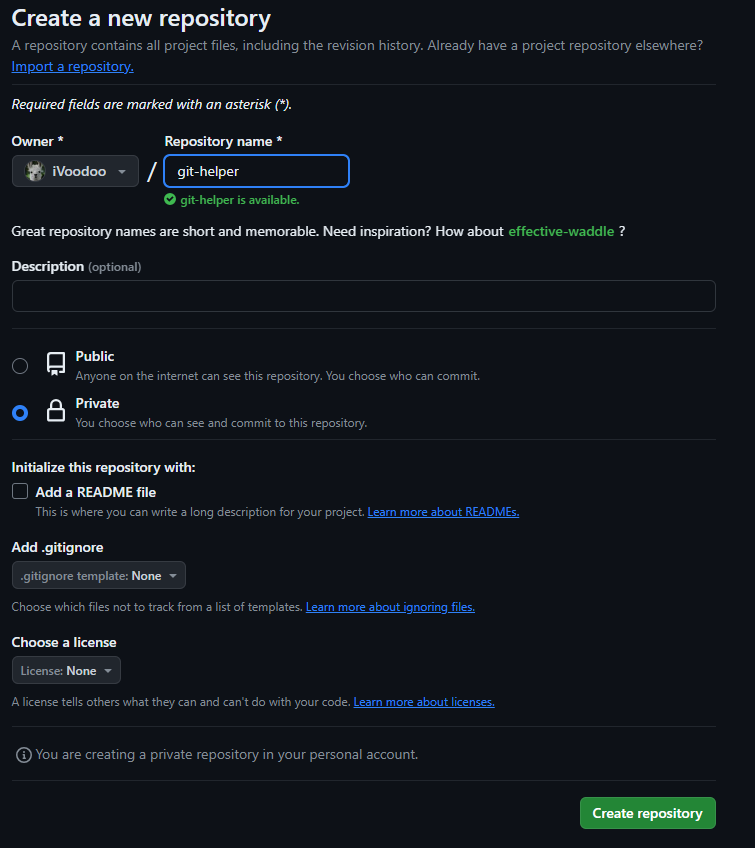
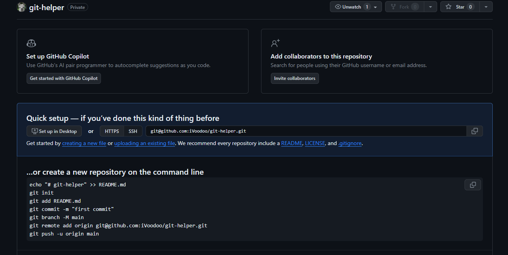
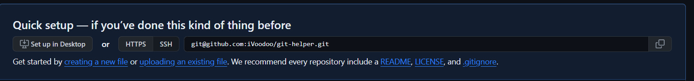
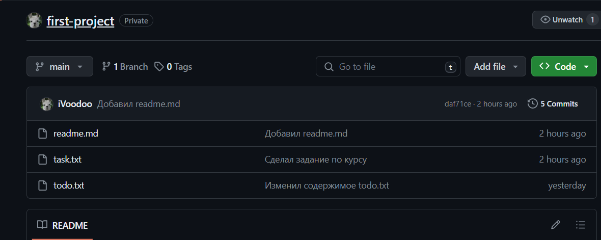

# Шпаргалка по работе с Git

Для работы с git нужно выполнить следующие действия:

1. Инициализировать репозиторий локально (т.е. на компьютере);
2. Создать удалённый репозиторий на GitHub;
3. Связать локальный репозиторий с удалённым.

## Инициализация репозитория

Репозиторий служит хранилищем файлов, папок проекта, над которым мы работаем

Следовательно, сперва нужно создать папку нашего проекта на диске компьютера. Сделать это можно **2 способами:**

1. Использовать привычный графический интерфейс проводника или ещё чего-то
2. Либо используя терминал

   ```bash
   cd <Название директории, где хотим создать проект>
   mkdir <Название папки проекта>
   ```

Далее следует этап инициализации репозитория:

```bash
git init
```

**Важное примечание**, чтобы всё это заработало необходимо скачать [git](https://git-scm.com/downloads "Скачать git")

---

Теперь мы можем создавать различные файлы в нашей папке, но чтобы git начал отслеживать (следить) за ~~приколами~~ изменениями в них нужно применить следующее заклинание.

```bash
git add <Название файла>
---
# В таком случае мы добавим все файлы в отслеживаемые
git add --all
# Та же команда, но короче
git add -A
```

Теперь чтобы сохранить наши изменения в репозитории нужны сделать commit (закоммитить наши изменения):

```bash
git commit -m "Текст сообщения для коммита в кавычках. Описывает то, какие изменения привнес этот коммит"
```

## Удаленный репозиторий

Для работы с удаленными репозиториями и организации командной работы существует множество платформ - одна из них GitHub.

Для того, чтобы начать ей пользоваться нужно пройти регистрацию на [площадке](https://github.com/ "GitHub")

После чего можно создать новый репозитории, кликнув по кнопке `new`, либо перейти по следующему пути браузера:

`https://github.com/new`

Теперь можно создать репозиторий, как на скрине ниже, либо самостоятельно заполнив поля:



Кликнув по кнопку `Create repository` получится следующая картина:



Последнее действие, которое нужно сделать создать SSH-ключ для доступа к GitHub. Нужно это для того, чтобы GitHub идентифицировал нас и дал доступ к репозиториям. Как это работает: мы создаем 2 ключа **публичный** и **закрытый** - **public** и **private** соответственно. Из названия ясно, что публичный ключ доступен всем, а закрытый либо приватный только нам - его создателям. Что мы получим: все, кто имеют публичный ключ, могут шифровать данные и передавать их нам. В свою очередь расшифровать эти данные и понять, что в них содержится, можно только при помощи закрытого ключа, который хранится у нас.

Как всё это дело настроить:

```bash
# переходим в домашнюю директорию и проверяем, есть ли ключи
cd ~ &&  ls -la .ssh/
```

Если пусто в директории, то вполняем следующий шаг для создания пары ключей, иначе пропускаем

```bash
ssh-keygen -t ed25519 -C "электронная почта,указанная при создании аккаунта на GitHub"
# если что-то пошло не так используем команду ниже
ssh-keygen -t rsa -b 4096 -C "электронная почта,указанная при создании аккаунта на GitHub"
```

Далее либо указываем место для хранения ключей, либо жмем `Enter` для места по умолчанию в домашней директории.

После чего можно ввести пароль к ключам, либо пропустить всё, нажимая `Enter`.

Теперь копируем публичный ключ:

```bash
# скопировать содержимое ключа в буфер обмена:
$ clip < ~/.ssh/id_rsa.pub
# для ed25519:
$ clip < ~/.ssh/id_ed25519.pub
```

Наконец-то возвращаемся в GitHub переходим в настройки и пункт SSH and GPG keys, либо по ссылке `https://github.com/settings/key`.

Наживаем на кнопку `New SHH key`, укзываем любое название и вставляем скопированный ключ, завершаем нажатием кнопки `Add SSH key`.

Чтобы убедиться в правильности наших действий, вернемся в терминал:

```bash
ssh -T git@github.com
# Далее либо следуем инструкции и вводим yes, либо увидим сообщение c приветствием с указанием имени нашего аккаунта на GitHub
```

## Связываем локальный репозиторий с удалённым

Для этого на странице нашего репозитория выбираем SSH и копируем путь:



В терминале, находясь в папке проекта, делаем следующее:

```bash
git remote add origin <То, что скопировали ранее>
# например так
git remote add origin git@github.com:iVoodoo/git-helper.git
```

origin - имя удаленного репозитория, а дальше url до него

Для проверки подключения пишем:

```bash
git remote -v
# Увидим нечто похожее:
origin  git@github.com:iVoodoo/git-helper.git (fetch)
origin  git@github.com:iVoodoo/git-helper.git (push)
```

И в завершении отправляем локальные изменения на удалённый репозиторий:

```bash
git push -u origin main # Если команда приведёт к ошибке, то следует
                        # заменить main на master.
```

В первый раз флаг `-u` прописываем, чтобы связать локальную ветку с удаленной, далее достаточно только `git push`.

В результате что-то похожее:



## Хеш

Хеш - это строка, полученная в результате применения функции хеширования к входному набору данных. Результат хеш-функции одинаков для одного набора данных. Малейшее изменение данных поменяет результат хеш-функции. **Важное замечание**, зная хеш, нельзя получить исходные данные.

В git хеш является идентификатором коммита. Гит хранит таблицу соответствий хешей и коммитов.

### Как посмотреть этот хеш

Прописываем команду `git log` и видим следующее

```bash
$ git log
commit 6993b14d233a66688b219c93090710c5b5d4d618   (HEAD -> master)
Author: Voodoo <email@yandex.ru>
Date:   Tue Feb 27 14:30:41 2024 +0300

    Отредактировал файл fileA.txt

commit f3f65216fca769071f9846b03b98d358488ae06b
Author: Voodoo <email@yandex.ru>
Date:   Tue Feb 27 14:26:47 2024 +0300

    Добавил файл fileA.txt

commit b6659086d1554a21b3ad39cdafa4f67258ca129d
Author: Voodoo <email@yandex.ru>
Date:   Tue Feb 27 14:24:47 2024 +0300

    Добавил README
```

`6993b14d233a66688b219c93090710c5b5d4d618` - это и есть хеш

Однако можно упростить вывод командой `git log --oneline`:

```bash
$ git log --oneline
6993b14 (HEAD -> master) Отредактировал файл fileA.txt
f3f6521 Добавил файл fileA.txt
b665908 Добавил README
```

В данном случае выводится не весь хеш, а лишь та часть, с помощью которой точно можно обратиться к коммиту. В данном случае это `6993b14`, что составляет часть хеша из примера выше `6993b14d233a66688b219c93090710c5b5d4d618`.

## HEAD

HEAD - ссылка на последний коммит.

Поэтому для того, чтобы обратиться к последнему коммиту можно использовать HEAD вместо хеша.

```bash
# Наглядно HEAD указывает на последний коммит в ветке master
6993b14 (HEAD -> master) Отредактировал файл fileA.txt
f3f6521 Добавил файл fileA.txt
b665908 Добавил README
```

## Статусы файлов в git

Файлы могут находиться в следующем состояние (статусе):

- untracked/tracked
- staged
- modified

### Untracked

Файлы, которые мы создали, но git не следит за их состоянием, находятся в состоянии untracked.
Это возможно в нижеперечисленных случах:

- только проинициализировали репозиторий командой `git init`
- создали новые файлы в существующем репозитории

Возникает вопрос, как заставить git следить за файлами. Так мы переходим к следующему статусу файлов.

### Staged

Файлы, за которыми git наконец-то следит и они готовы к коммиту, имеют статус staged.
Чтобы этого добиться, нужно прописать команду `git add`, рассмотренную ранее. После этого файл попадает в **staging area**. Файлы из этого списка попадут в коммит.

### Tracked

Это состояние диаметрально противоположно untracked.
Проще говоря, файлы, которые коммитили ранее или подготовили к коммиту через `git add`, имеют статус tracked.

### Modified

Исходя из названия - это файлы, как-то модифицированные.
Если мы вносим правки в уже существующий файл (tracked), то у него статус modified. Это касается не только файлов, которые были закоммичены ранее, но и новых файлов, добавленных через `git add`.
Представим, мы создали файл, добавили его в **staging area** посредством `git add`. Решаем делать коммит, но вспоминаем, что забыли кое-что поменять в файле. Делаем правки, пишем `git status` и видим, что у нас 2 файлы, один из которых staged, а второй modified. Так вот, наш изначальный файл - staged и он понятия не имеет о правках. Второй же файл в статусе modified.

Резонный вопрос: **"Как добавить в коммит файл с правками?"**. Ответ прост - нужно добавить новый файл в **staging area** нашей любимой командой `git add`. Таким образом мы получим в **staging area** последнюю версию файла, а следовательно она пойдет в коммит.

### Жизненный цикл файла в Git


## Как правильно оформлять сообщение к коммиту

При оформлении сообщения, стоит придерживаться следующих правил:

- Информативность - коллеги должны понимать, что привнес, исправил конкретный коммит
- Краткость - не стоит писать текст из 10 предложений. Можно, например, ограничиваться 72 символами, т.к. команда `git log --oneline` выводит первые 72 символа сообщения.

Это общие правило, однако в команде могут быть различные соглашения о том, как следует оформлять коммит. Также существует [Соглашение о коммитах](https://www.conventionalcommits.org/en/v1.0.0/ "Документация Соглашения о коммитах") (Conventional Commits), которое содержит набор правил и практик по оформлению коммитов.
